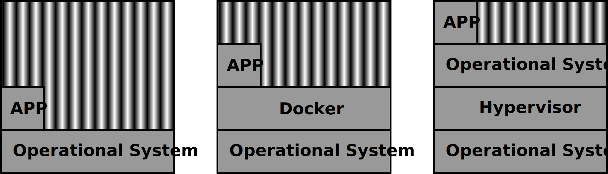
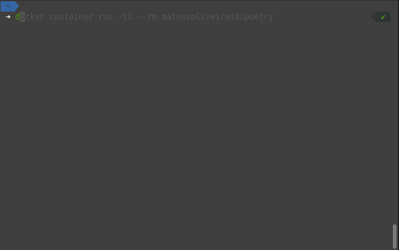

# Wiki

- [Repository's README](../README.md)

## Motivation

In all my personal Python projects I use Poetry, and I always like to build a Docker development environment. So, to keep the DRY (Don't Repeat Yourself) principle when writing Dockerfiles, I created this repository.

## What is Docker?

[Docker](https://docs.docker.com/get-started/overview/) is a tool for **building** and **sharing** **Containers**.

### What is a Container?

A Container is an application packaging (it's code and dependencies), that can run **independent** of the environment or host machine.

A Container is a runnable instance of an **Image**.

### What is an Image?

An image are the **Read Only** **Layers** of a Container.

### What are Layers?

Layers are the instructions for creating and running a Container.

### How that works?

Let's check out how this looks for three scenarios:
- an application running natively in the host machine
- an application running in a Docker Container in the host machine
- an application running in a Virtual Machine in the host machine



> Hypervisor is a software that creates and runs Virtual Machines.

Containers share the **Kernel** (Linux) of the host machine. Virtual Machines need to emulate a new Operational System.

If we zoom in the the APP running in the Docker Container, we would see something like this


Only the running Layer (the last one) can be modified.

### Running Docker



The command `docker container run -ti --rm mateusoliveira43/poetry` was run in the host machine. Since the Image was not built, it was built before running the Container. Then, inside the Container, the command `poetry --version` was run.

To build an Image, run
```
docker image pull <user>/<repo>
```

To run a Container, run
```
docker container run <user>/<repo>
```

To push an Image to [Docker Hub](https://hub.docker.com/), run
```
docker login
docker image push <user>/<repo>:<tag>
docker logout
```

## What is Poetry?

[Poetry](https://python-poetry.org/) is a tool for **dependency management** and packaging in Python.

### How that works?

Poetry can be used to create reproducible environments, because it pins the versions of the libraries the project uses, with the `pyproject.toml` and `poetry.lock` files.

It can also be used to install only production dependencies and create the usual `requirements.txt` file, so that the project does not depends in Poetry to run.

### Running Poetry


The following commands were run, in the following order
1. `docker container run -ti --rm mateusoliveira43/poetry` to connect to Container's shell.
1. `poetry new examplemon` to create a new project structure.
1. `cd examplemon`
1. `ls -1a`
1. `poetry install` to install the project's dependencies in a virtual environment.
1. `poetry add -D pytest@latest` to update pytest.
1. `poetry shell` to activate the project's virtual environment.
1. `pytest`
1. `CTRL+D` to deactivate the project's virtual environment.
1. `CTRL+D` to exit the Container's shell.

## Using Poetry and Docker for development

To start using Docker and Docker Compose for developing a Python project with Poetry, you need to:
- Create a `.env` file in the project's root.
- Create a folder called `docker` in the project's root, and add two files in it:
    - one called `Dockerfile`.
    - the other called `compose.yaml`.

The project's root should look like this.
```
.
├── docker
│   ├── compose.yaml
│   └── Dockerfile
├── poetry.lock
├── pyproject.toml
└── project_name
    └── ...
```

Add the `.env` content:
```
GROUP_ID=1000
USER_ID=1000
USER_NAME=develop
SERVICE_NAME=service-name
WORK_DIR=/home/develop/service-name
```

Add the `Dockerfile` content:
```dockerfile
FROM mateusoliveira43/poetry:latest

ARG GROUP_ID=1000
ARG USER_ID=1000
ARG USER_NAME=develop
ARG WORK_DIR=/home/$USER_NAME/PROJECT

RUN groupadd --gid $GROUP_ID $USER_NAME \
    && useradd --uid $USER_ID --gid $GROUP_ID --create-home $USER_NAME \
    && runuser --user $USER_NAME -- mkdir $WORK_DIR
USER $USER_NAME

WORKDIR $WORK_DIR
COPY pyproject.toml poetry.lock ./
RUN poetry install
```

Add the `compose.yaml` content:
```yaml
services:
  service-name:
    image: ${SERVICE_NAME}
    container_name: ${SERVICE_NAME}
    hostname: docker
    entrypoint: ["poetry", "run"]
    command: ["/bin/bash"]
    build:
      context: ./
      dockerfile: ./docker/Dockerfile
      args:
        GROUP_ID: ${GROUP_ID}
        USER_ID: ${USER_ID}
        USER_NAME: ${USER_NAME}
        WORK_DIR: ${WORK_DIR}
    volumes:
      - type: bind
        source: ./
        target: ${WORK_DIR}/
      - type: volume
        source: virtual-environment
        target: ${WORK_DIR}/.venv/

volumes:
  virtual-environment:
```

### The good part

Since we run `poetry run` in the Container entrypoint, it is not needed to activate the virtual environment to run commands in the Container.

Since we use bind volumes in the compose file, the Container immediately sees when a new file is added to the host machine, and copies it to the Container. It also copies the files created in the Container to the host Machine, creating a fast environment for developing. Adding a different user to the Container, instead of the normal root one, is to allow the files copied from the Container to the host machine to have the same owner.

Since we use a volume for the virtual environment, when the Container is killed, we can immediately bring it back up just by having it's Image, only needing to install the dependencies once.

And the most valuable part is that to run a development environment like this, you just need Docker and Docker Compose installed, because a Container runs **independent** of the environment or host machine.

### The bad part

Since there is the Docker layer for running the APP, it will be slower then running natively. But sometimes, you don't even see the difference.

It will take more space in the host machine (because of the bind Volume, the project size is duplicated, when running it).

But if that's not a problem, removing the necessity of the developers to install the project tools (only needing to Install Docker and Docker Compose to run it), can overcome the downsides.

### running

In the project's root, run
```
docker-compose --file docker/compose.yaml --project-directory ./ run --rm <service-name>
```
to connect to container's shell and run all commands needed for development there. To exit the container's shell, run `CTRL+D` or `exit`.

Or check out [Docky](https://github.com/mateusoliveira43/docky), a CLI for running Docker and Docker Compose with ease.

## References :books:

- https://github.com/badtuxx/DescomplicandoDocker
- https://www.youtube.com/playlist?list=PLf-O3X2-mxDn1VpyU2q3fuI6YYeIWp5rR
- https://docs.docker.com/
